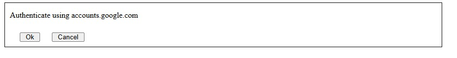
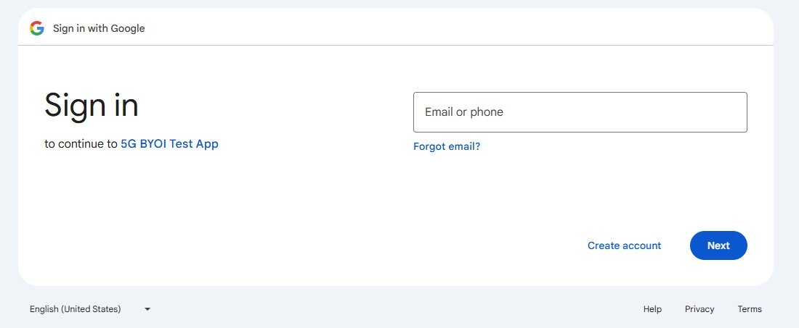
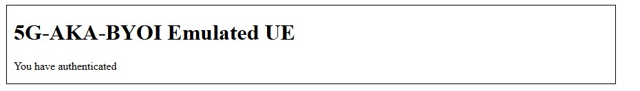

# 5G-AKA-BYOI

This directory contains the prototype implementation of 5G-AKA-BYOI and the
associated Tamarin model. For review purposes only --- this repository needs cleanup!

## Licence

For the present, this is being made available for review purposes only. All rights reserved by the authors.

## Subdirectories

`shared` contains implementations of cryptographic and data-processing
operations from the 3GPP Technical Specifications such as SUCI encryption,
SQN generation, and the MILENAGE algorithm. Some of these may be of independent
interest to other implementations. A test suite is included for some operations,
and may be run using `gradle test`.

`tamarin` contains the Tamarin model.

`ue-emulator` contains the prototype implementation.

`util` contains scripts used to generate test data.

## Tamarin

The Tamarin model may be built by running `make` under the `tamarin` directory.

The model will be found under `tamarin/thy/byoi_stg1.spthy`. The model is
self contained: an oracle is embedded in the same file. Tamarin version
1.8.0 or greater is required to support the embedded oracle feature (called
tactics) and to support natural numbers.

Beware that the model is fairly complex. The number of saturations may need to
be reduced (e.g. `-s3`) to ensure to model does not consume too much memory.
Even then, at least 128 GB of RAM was found to be required.

A model of the Andrews protocol is also included under `tamarin/thy/andrews.spthy`
as a demonstration of the modified weak agreement concept developed in [^1].

[^1]: Parkin, J.: Identity and Security in 5G Authentication. Master’s thesis, University of Waterloo (2024)

## Prototype Implementation

This section describes how to run the prototype implementation.

### Prerequisites

The commands in this document assume the use of Linux, but it is likely
possible to adapt to other platforms.

Ensure that Gradle and any packages required for building and running Java
programs are installed.

A OAuth2.0 client registered with Google is required. The `redirect_uri` used
by the client is
```
http://127.0.0.1:8080/oauth2-callback
```

Provide the client's ID and secret using the environment variables:
```
export GOOGLE_OAUTH2_CLIENT_ID=...
export GOOGLE_OAUTH2_CLIENT_SECRET=...
```

### Steps

  1. Build the project and copy the installation to a known location (in these
     steps, /opt is assumed):

     ```
     cd ue-emulator
     gradle installDist && cp -r build/install/ue-emulator/ /opt
     ```

  2. Run the UE Emulator with these arguments:

     ```
     /opt/ue-emulator/bin/ue-emulator run ca.uwaterloo.fivegakabyoi.ueemulator.UeEmulator
     ```

     To display all log messages, set `JAVA_OPTS=-Dueemulator.loglevel=trace`.
     You may monitor the log message using

     ```
     tail -f /var/log/5g-aka-byoi/ue-emulator/ue-emulator.log
     ```

  3. Navigate to localhost:8080 in a browser and enter a User ID (email) of
     a Google account.

     

  4. The UE will ask to confirm the authentication after receiving an
     authentication request:

     

  5. Confirming will redirect to Google for OAuth2.0 authentication:

     

  6. After finishing authentication, the UE will display a success message:

     

     You may inspect the log under

     ```
     /var/log/5g-aka-byoi/ue-emulator/ue-emulator.log
     ```

     for details such as the messages exchanged between parties.
